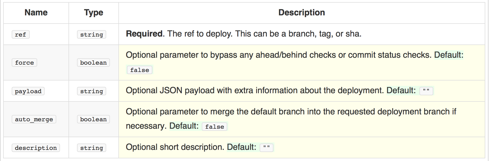

% Versionskontrollsysteme. Von Xanadu bis git

# Diffs

# Komplexere Textformate

[Rendered Prose Diffs](https://github.com/blog/1784-rendered-prose-diffs)
für GitHub Markdown (seit Feb 2014).

# Diffs für andere Dokumentarten

Je nach Dokumentart/Dateiformat

* Textformate
* Bilder, Audio, Video (?)
* Karten
* 3D-Modelle
* ...

# Diffs für Geodaten

GitHub:
[Diffable, more customizable maps](https://github.com/blog/1772-diffable-more-customizable-maps)
für `geojson` Dateien (seit Feb. 2014). 

# Diffs für 3D-Modelle

GitHub: [3D File Diffs](https://github.com/blog/1633-3d-file-diffs)
für `stl` Dateien (seit Sept. 2013).

