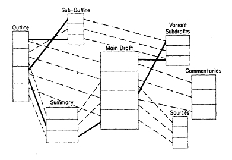
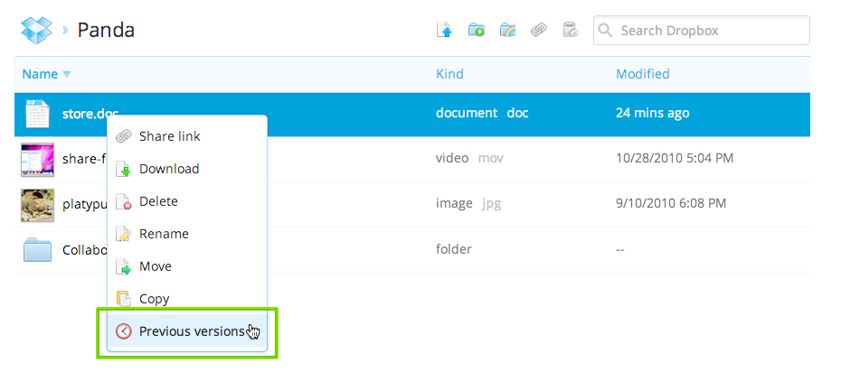
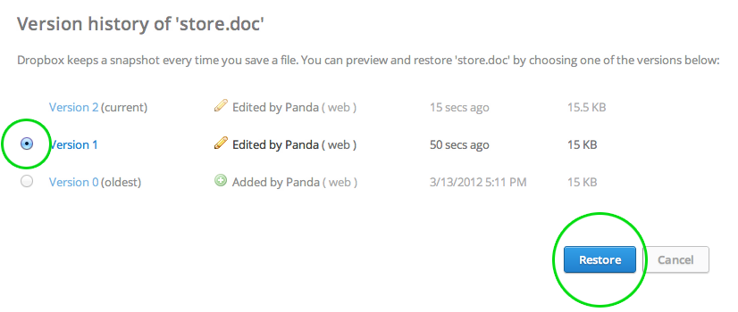
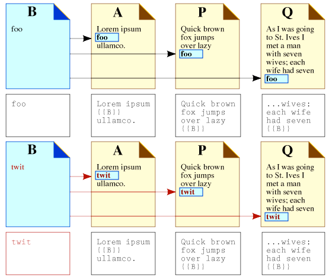
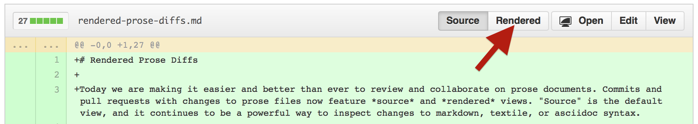
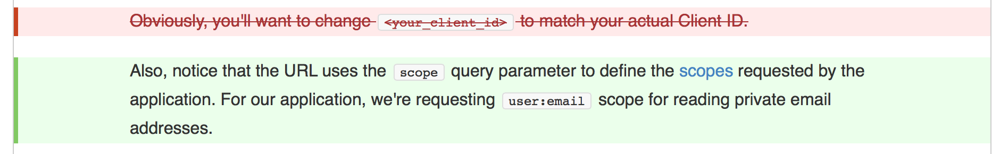
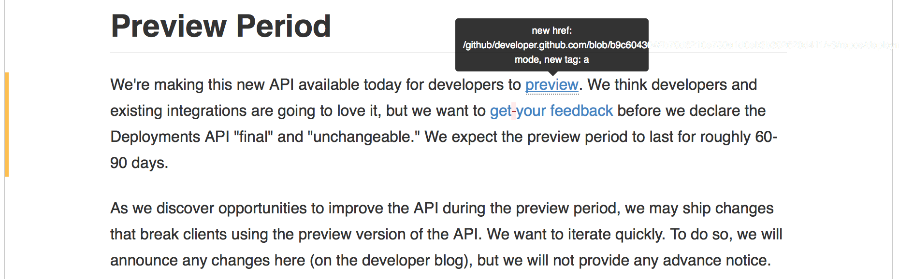
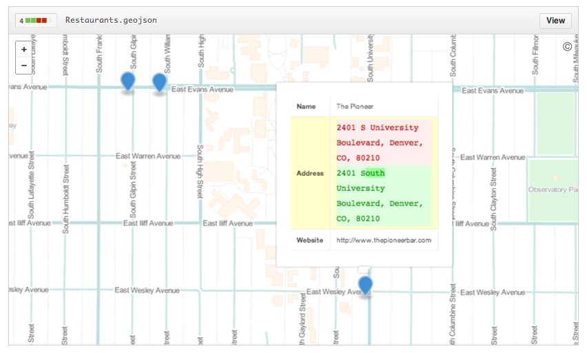

% Versionskontrollsysteme
% Dr. Jakob Voß
% 2014-03-10

# Vorgeschichte

* Arpanet (1962/1969)
* Multics (1963/1969) und Unix (1972)
* WWW (1989/1990)
* Google (1996)
* Wikipedia (2001)

# Once upon a time... 

Anfang der 1960er gab es

* Keine Computer (außer Militär & Forschung)
* Keine Rechnernetze
* Keine einheitlichen Dateisysteme
* Keine Textverarbeitung
* Keine Hypertexte

# IBM 709 (1958-1959)

# Once upon a time in Xanadu

> Mr. Asimov, soon we'll be reading and writing on computer screens.
--- Ted Nelson, 1961^[zitiert nach @Nelson2010, Seite 128.]

* 1960/19061 nimmt Ted Nelson (23) in Harvard an einem Computerkurs teil. Ihm
  wird klar, dass mit Computern **Dokumente verwaltet** werden könnten.

* Er nennt das von ihm erdachte System "Xanadu".

* Außer Douglas Engelbart versteht niemand was er meint.

# Xanadu und Hypertext

* 1965 stellt Ted Nelson seine Ideen von "Hypertext" auf zwei Konferenzen vor 
  [@Nelson1965; @Nelson1965a].^[ACM und FID. Der FID-Vortrag ist praktisch völlig vergessen.]
* Das Multics-Dateisystem [@Daley1965], verweist auf seine Arbeit, entscheidet
  sich aber für eine Hierarchie.
* Nelsons inspiriert viele, die die Computer-Revolution umsetzen
  (Bill Gates, Tim-Berners-Lee...)
* Xanadu wird jedoch falsch verstanden oder ignoriert
* Erfindungen: Hypertext (1963), Transclusion, Zurück-Button...

# Hypertext nach @Nelson1965

# Ende der Vorgeschichte

> I mistook a clear view for a short distance\
--- Ted Nelson

# Versionskontrollsysteme

* Speicherung mehrerer/aller Versionen eines Dokumentes
* Analog: Bibliotheke archivieren auch ältere Auflagen\
  (vor allem aus historischen Gründen)

# Populäre Beispiele (mit aufsteigender Komplexität)

* Dropbox
* Wikipedia
* git

# Versionen in Dropbox

Speichert ältere Dateiversionen der letzten $\geq$ 30 Tage

# Versionen in Dropbox

# Wikipedia

Siehe "Versionsgeschichte" oder\
<https://de.wikipedia.org/wiki/Spezial:Letzte_Änderungen>

# Transclusion in Wikipedia/MediaWiki

Mediendateien, andere Seiteninhalte & Inhalte aus Wikidata

# Versionskontrollsysteme für Quellcode

* Gemeinsame Versionierung vieler Dateien
* Snapshots ("Tags")
* Branches
* Fork und Merge

# git

* Entwickelt vom Linux-Erfinder Linus Torvalds
* *Verteiltes* Versionskontrollsystem
* Komplexe Vielfalt an Möglichkeiten

# GitHub

* Populärste Webanwendung zur Verwaltung von git-Repositories
* Integriert viele Tools zur Softwareentwicklung
* Nicht primär für Arbeit an anderen digitalen Objekten

# git-Konzpte

Commit
  : Änderung an einer oder mehreren Dateien
Repository
  : Azyklischer Graph von Änderungen
Tag
  : Fester Zeiger auf eine Version
Branch
  : Fortlauender Zeiger auf eine Version

# Änderungen in Versionskontrollsystemen

* Verschieben oder Umbenennen von Dateien^[Nelson's Xanadu sieht dagegen keine Dateien vor.]
* Neue Dateien oder Löschung von Dateien
* Änderung an Dateien
    * Vollständige Ersetzung durch neue Datei
    * Änderung an ausgewählten Stellen ("Diffs")

# Diffs

* Wesentlich für *alle* Versionskontrollsysteme!
* Erfordern Kenntnis über die innere Struktur von Dateien

# Komplexere Textformate

*[Rendered Prose Diffs](https://github.com/blog/1784-rendered-prose-diffs)*
für GitHub Markdown (seit Feb. 2014)

\
\

# Komplexere Textformate

*[Rendered Prose Diffs](https://github.com/blog/1784-rendered-prose-diffs)*
für GitHub Markdown (seit Feb. 2014)

\

# Diffs für Geodaten

[Diffable, more customizable maps](https://github.com/blog/1772-diffable-more-customizable-maps)
für `geojson` (seit Feb. 2014) 

# Diffs für Geodaten

[Diffable, more customizable maps](https://github.com/blog/1772-diffable-more-customizable-maps)
für `geojson` (seit Feb. 2014) 

# Diffs für 3D-Modelle

[3D File Diffs](https://github.com/blog/1633-3d-file-diffs)
für `stl` Dateien (seit Sept. 2013)

# Diffs für 3D-Modelle

[3D File Diffs](https://github.com/blog/1633-3d-file-diffs)
für `stl` Dateien (seit Sept. 2013)

# Hausaufgabe

* Erstellung eines GitHub-Accounts zum Zugriff auf
  <https://github.com/hshdb/hshdb2014-aufgaben>
* Erstellung eines Accounts bei <http://penflip.com/> zum einfacheren 
  Schreiben der Markdown-Ausarbeitung 
* Alternativ Lesen einer
  [Einführung in git](http://rogerdudler.github.io/git-guide/index.de.html).

# Bildquellen

[IBM 704](https://commons.wikimedia.org/wiki/File:IBM_Electronic_Data_Processing_Machine_-_GPN-2000-001881.jpg)
21 March 1957 by NASA (public domain)
 
"zippered lists" aus @Nelson1965

[MediaWiki-Transclusion](https://commons.wikimedia.org/wiki/File:Transclusion-multiple-twit.png)
CC-BY-SA <https://en.wikipedia.org/wiki/User:Xiong>

# Literatur
