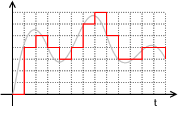

% Digitalität: grundlegende Eigenschaften von Daten
% Dr. Jakob Voß
% 2014-03-17

# Digitale Bibliotheken

**Digitale Bibliotheken** sind Einrichtungen oder Anwendungen, in denen
digitale Medien, gesammelt, geordnet, bearbeitet und/oder verfügbar gemacht
werden. Der Begriff ist dabei mehr als Metapher statt als trennschafe
Gattungsbezeichnung zu verstehen.

# Digitale Medien

* Praktisch synonym mit **elektronischen Medien** (abgesehen von Analogen
  elektronischen Medien wie Analog-Radio, -TV, -Video, -Audio auf Magnetband)

* Medien, deren Inhalte **digital kodiert** sind

* Alle Medien dienen der Kommunikation (im weitesten Sinne)

# Digitale Dokumente

* Digitale Medien, die als Einheit festgehalten (gespeichert) sind

* Daten, die eine Einheit bilden

# Was sammeln digitale Bibliotheken denn nun?

* Digitale Medien
* Digitale Dokumente
* Digitale Publikationen
* Digitale Objekte
* Digitale Resourcen
* Datensätze
* Dateien
* ...
* **Daten**

# Was für Daten sind in Digitalen Bibliotheken relevant?

* Publikationen
    * Bisherige Publikationen sind zunehmend digital
    * Neue Publikationsformen sind digital
    * Aufgezeichnete Kommunikation
* Metadaten

# Publikationen

* (Retro)digitalisierte Publikationen
* Originär digitale Publikationen ("born digital")
    * Angelehnt an analoge Formen (z.B. PDF)
    * Neue Publikationsformen (Spiele, Blogartikel, Forschungsdaten...)
 
# (Retro)digitalisierte Publikationen

Digitalisierung
  : Überführung von analogen Signalen (Zeit, Lautstärke, Farbe, Größe...) in
    Messwerten, die digital kodiert gespeichert werden.

*...mehr zu Digitalisierung am am 12.5.*

# Digitale Kodierung: Bestandteile

Quantisierung
  : Begrenzte Menge zulässiger **Werte**\
    (z.B. Rot, Grün- und Blauanteil je 0 bis 255)
Datenformate
  : Definierte **Strukturen**\
    (z.B. Felder, Dimensionen, Ordnungsmethoden, Muster...)

# Analog-Digital-Umsetzung / Sampling / Quantisierung



# Daten nach Strukturierungsgrad

* unstrukturiert
* semi-strukturiert
* strukturiert

# Digitale Kodierung: Beispiele

Unstrukturiert
  : Natürlichsprachlicher Text
Semi-strukturiert
  : Email, Text in XML, ...
Strukturiert
  : Klar definierte Bestandteile

Abhängig davon, welche Bestandteile automatisch verarbeitet werden sollen.

# Digitale Kodierung: Beispiele

* $12 = 8+4 = 1 \cdot 2^3 + 1 \cdot 2^2 + 0 \cdot 2^1 + 0 \cdot 2^0$\
  `1100` = `0C` (hex)
* Gelb: `#FFD700` (255/255 Rot + 215/255 Grün + 0 Blau)
* "A": `65` (ASCII) = `41` (hex) = `01000001` (binär)
* $\pi \approx 3.14159\ldots \approx +1\cdot2^1\cdot 1.570796\ldots$\
  `0 10000000 10010010000111111011011` (IEE 754)

# Digitale Kodierung: Beispiele


Unicode `U+00C5` (und `U+212B`),`&Aring;` und `&#xC5;` (HTML)...

# Was für Daten sind in Digitalen Bibliotheken relevant?

1. Publikationen
    * (Retro)digitalisierte Inhalte
    * Originär digitale Publikationen
    * Aufgezeichnete digitale Kommunikation
2. Metadaten

# Originär digitale Publikationen ("born digital")

*Vorschläge?*

# Born digital

* Nachgemachte Analogmedien ("Seiten")
* Tatsächliche neue Formen (Hypertext, beyond-the-PDF...)

# Aufgezeichnete Kommunikation

...potentiell *alle Formen von Daten*, sobald sie als publizierte Einheit
zusammengefasst sind.

* Unklare Grenze zwischen Publikation und Kommunikation
* "Graue Literatur"
* Publikation ist nicht technische sondern sozial definiert

# Metadaten

* "Daten über Daten"
* keine einheitliche Definition
* Zwei Schwerpunkte
    * Informatik:\
      Daten über Datenformate, -typen, -strukturen...
    * Bibliotheks- und Informationswissenschaft:\
      Daten über (u.A. digitale) Dokumente
* Übersicht von Metadaten bei @Kogalovsky2013

# Metadaten: Häufige Unterteilung

* **Beschreibende Metadaten**\
  Sach- und Formalerschließung, Identifier...
* **Strukturdaten**\
  Inhaltliche Bestandteile und Zusammenhänge, z.B. Kapitel- und Dateistrukturen
* **Verwaltungsdaten**
    * Provenienz (Herkunft)
    * (Zugriffs)rechte
    * Technische Verwaltungsdaten (Betriebsystem u.Ä.)

# Metadaten oder Daten?

* Abhängig vom Standpunkt
* Relevante Daten sind immer *über* etwas
* Metadaten über Metadaten über Metadaten...
* Metadaten konstituieren Dokumente

# Zwischenfazit

* Digitale Bibliotheken beschäftigen mit Daten
* Dabei sind zwei Formen von Daten relevant:
    * Digitale Dokumente
    * Metadaten
* Daten entstehen durch Digitalisierung oder direkt in digitalen Systemen
* Daten bestehen aus Werten und Strukturen, mit unterschiedlichen
  Strukturierungsgraden
 
---

Frage an alle: 

1. Was sind Daten ganz allgemein? 
2. Nenne 2-3 Beispiele

----

# Was sind eigentlich Daten?

* Anscheinend heutzutage sehr wichtig\
  (Linked Data, Big Data, Forschungsdaten, Metadaten...)
* Keine einheitliche Definition

# Definitionen von Daten

* Prinzipiell sind Daten Unterschiede
* Luciano Floridis diaphorische Definition von Daten

> $x$ being distinct from $y$, where $x$ and $y$ are two uninterpreted 
> variables and the relation of ‘being distinct’, as well as the domain, 
> are left open to further interpretation.

# Verschiedene Auffassungen von Daten

* Daten als Fakten
* Daten als Beobachtungen
* Daten als binäre Nachrichten

# Daten als (harte) Fakten

* objektive, reproduzierbare Ergebnisse von Messungen
* liefern wahre Aussagen über die Realität
* naturwissenschaftliche Sicht

# Daten als (subjektive) Beobachtungen

* aufgezeichnete Wahrnehmungen
* prinzipiell subjektiv
* benötigen Kontextwissen zur Auswertung

# Daten als (beliebige) binäre Nachrichten

* Zeichen, die zur Kommunikation dienen
* Daten haben semiotischen Charakter
* Letzendlich eine Folge von Bits
* Wesentlich ist ihre Funktion als Zeichen

# Was sind Nachrichten/Zeichen?

* *nicht* im Sinne der Informationstheorie!
* ...

# Dokumente als Zeichen

* Was ist ein Dokument?
* Wesentlich ist nicht der Inhalt
* Sondern die Funktion als Zeichen (zur Dokumentation von etwas) 

# Digitales Dokument = Einheit von Daten

Nach @Voss2013 sollte sich die Bibliotheks- und Informationswissenschaft mehr
mit Daten beschäftigen statt über Dokumente zu reden.

# Digitalität

* Diskrete **Werte** (Quantisierung)
* Beliebige **Strukturen** (Formate, Schemata...)

*Wie sehen diese Strukturen aus?*

# Beispiel: BibTeX

```
@misc{voss2014librarians,
  author = {Voß, Jakob},
  title  = {Old librarians like books. 
            New librarians like data. 
            Good librarians like people.}
  booktitle = {Twitter},
  year   = {2014},
  day    = {28},
  month  = {2},
  url = {https://twitter.com/nichtich/status/438186931139383296}
}
```

# Beispiel: JSON

```
{
  "text": "Old librarians like books. New librarians like data. Good librarians like people.",
  "id": "438186931139383296",
  "retweet_count": "117",
  "favourites_count": "73",
  "source": "web",
  "user": {
    "name": "nichtich",
    "location": "Nauru"
  }
}
```

# Beispiel: PICA

```
001A $00206:14-10-13
001B $02001:20-02-14$t01:44:21.000
001D $00206:23-10-13
002@ $0Aau
003@ $0769846149
004A $A9781490931869
010@ $aeng
011@ $a2013
019@ $aXD-US
021A $aDescribing data patterns
     $da general deconstruction of metadata standards
     $hJakob Voß
028A $dJakob$aVoß$9766345386
033A $p [North Charleston]
     $nCreateSpace Independent Publishing Platform
```

# Beispiel: XML

```
<record>
  <datafield tag="011@">
    <subfield code="a">2013</subfield>
  </datafield>
  <datafield tag="004A">
    <subfield code="A">9781490931869</subfield>
  </datafield>
  <datafield tag="028A">
    <subfield code="d">Jakob</subfield>
    <subfield code="a">Voß</subfield>
    <subfield code="9">766345386</subfield>
  </datafield>
</record>
```

# Datenmodellierung

* Prozess zur Erstellung von Datenbanken, Ontologien etc. 
* implizit Grundlage *aller* Daten


# Datenmodellierung: Beispiel

*Siehe Aufgabenverteilung letzte Woche*

# Daten lesen lernen

Muster in Daten

<http://aboutdata.org/patterns.html>

# Beispiele für Muster in Daten

* Ist ein Datenelement *wiederholbar* oder nicht?
* Spielt die *Reihenfolge* eine Rolle?
* Kann ein Element andere Elemente *enthalten*?
* *Impliziert* das Vorkommen eines Elements ein anderes?
* ...

# Braten statt Daten 

*Guten Appetit!*

# Literatur
