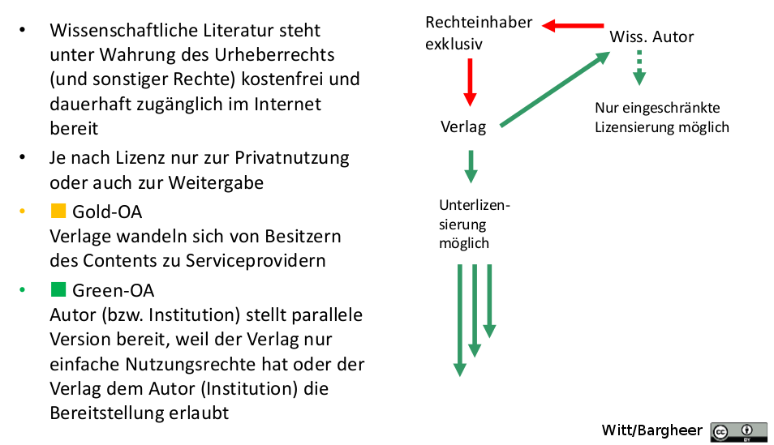
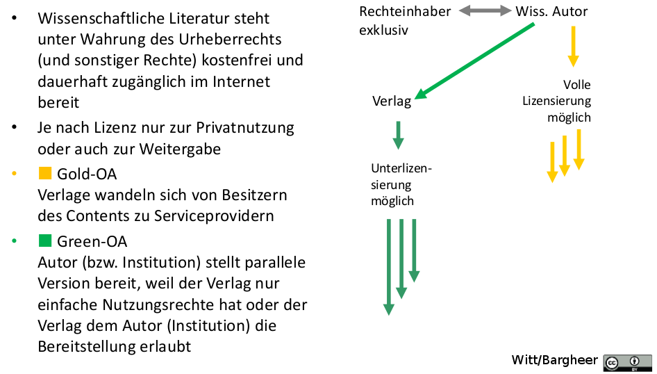

% Open Access und Open Archives
% Dr. Jakob Voß
% 2014-03-17

# Vorgeschichte: Aaron Swartz

# Aaron Swartz (1986-2013)

* Gründer oder Mitarbeiter von/bei: RSS (mit 14), Creative Commons (mit 15),
  RDF/XML, Markdown (!), Infogami/Reddit, SOPA...
* Bekam 2006 den Katalog der LoC frei (legal)
* 2010/2011 am MIT 4,8 Millionen Artikel von JSTOR
* keine Anklage durch JSTOR, Ende 2011 gemeinfreie Teile frei 
* weitere Verfolgung durch US-Staatsanwaltschaft wegen Copyright-Verstößen
  (bis zu 35 Jahre Haft)
* Selbstmord im Januar 2013 (verschiedene Gründe)

# Was bedeutet Open Access?

* Unbeschränkter Zugang zu über das Internet zu (wissenschaftlichen) Dokumenten
* Bei elektronischen Publikationen *eigentlich* kein Thema:
  hochladen, auffindbar machen, fertig

# Vorgeschichte II: Stephen Hawking

<http://phenomena.nationalgeographic.com/2014/02/19/scientists-on-the-loose-my-aaas-talk/>

# Warum ist Open Access ein Thema?

* Wissenschaftler publizieren in der Regel
    * um ihre Erkenntnisse und Ergebnisse zu teilen
    * *nicht* um damit Geld zu verdienen

* Verlage publizieren in der Regel
    * weil sie damit besser auskennen
    * um damit Geld zu verdienen

* Zugangsbeschränkungen für kostenpflichtige Inhalte

# Unbeschränkter Zugang zu digitalen Dokumenten

* kostenfrei, unwiderruflich, weltweit
* herunterladen, kopieren, drucken, durchsuchen, verlinken...
* Weitergabe von Original, Auszügen & Zusammenfassungen
* je nach Auffassung/Lizenz auch weitere Bearbeitung

...sofern die Urheber angemessen kenntlich gemacht werden.

# Rechte & Lizenzen

* **Urheberrecht:** Wer hat es geschaffen?
* **Verwertungsrechte:** Wer darf etwas damit anfangen?

Freie Lizenzen, üblicherweise Creative Commons (CC):

 Attribution: Namensnennung

 ShareAlike (SA): Weitergabe unter gleichen Bedingungen

 NoDerivatives (ND): keine Bearbeitungen

 NonCommercial (NC): keine kommerziellen Zwecke

*...mehr zu Rechten und Lizenzen am 12.5.*

# Definitionen und (Absichts)erklärungen

Januar 2002: **Budapester Open Access Erklärung**
<http://www.budapestopenaccessinitiative.org/translations/german-translation>

> Frei zugänglich im Internet sollte all jene Literatur sein, die Wissenschaftlerinnen und Wissenschaftler ohne Erwartung, hierfür bezahlt zu werden, veröffentlichen

Oktober 2003: **Berliner Erklärung** über offenen Zugang zu wissenschaftlichem Wissen
<http://openaccess.mpg.de/3515/Berliner_Erklaerung>

> ...zu kopieren, zu nutzen, zu verbreiten, zu übertragen und öffentlich wiederzugeben sowie Bearbeitungen davon zu erstellen und zu verbreiten...

# Open Access im engeren Sinne

* Freigabe der Dokumente
* Archivierung auf Dokumentenserver

Somit sichergestellt, dass Dokumente dauerhaft frei genutzt werden können.

# Viele warme Worte 

Unterzeichner der Berliner Erklärung, u.A.:

* *Deutsche Forschungsgemeinschaft (DFG),
  Fraunhofer-Gesellschaft,
  Helmholtz-Gemeinschaft,
  Wissenschaftsgemeinschaft Gottfried Wilhelm Leibniz,
  Max-Planck-Gesellschaft (MPG),
  Deutsche Initiative für Netzwerkinformation (DINI),
  Deutscher Bibliotheksverband (dbv),
  Hochschulrektorenkonferenz, Wissenschaftsrat, ...*

Weitere Positionspapiere und (Absichts)erklärungen:
<http://open-access.net/de/allgemeines/was_bedeutet_open_access/initiativen_und_positionspapiere/>

# Mehr als Worte

1991 setzte Paul Ginsparg einen Server für Physik-*Preprints* auf

<http://ArXiV.org>

# Open Archives / Repositories

* Institutionelle Repositories (Herkunft)
* Fachliche Repositories (Fachgebiet): arXiV, PubMed, RePEc...

<http://en.wikipedia.org/wiki/Disciplinary_repository>

*...mehr zu Repositories am 31.3.*

# Die Zeitschriftenkrise

> In the last 30 years, the prices of scientific journals have been steadily increasing. 
> Between 1975 and 1995, they increased 200%- 300% beyond inflation.^[European Commission (2006): Study on the economic and technical evolution of the scientific publication markets in Europe.]

* Zeitschriftenmonopole bei großen Verlagen (u.A. Elsevier)
* Orbitante Preiserhöhungen
* Abbestellungen und eingeschränkter Zugriff

# Warum nicht einfach nur noch Open Access?

* Kapitalismus abschaffen!

# Warum nicht einfach nur noch Open Access?

* Absichtserklärungen sind geduldig
* Kulturelles und Soziales Problem

Mögliche Druckmittel

* Obligatorische Mandate für OA
* Mittelvergabe
* Verlage

# Positives Beispiel

* National Institutes of Health (NIH)
* PubMed Central
* maximal 12 Monate nach Erscheinen

# Formen von Open Access

Grüner Weg
  : Open Access-Publikation parallel oder zeitversetzt zur Originalpublikation

Goldener Weg
  : Open Access direkt beim ersten/eigentlichen Erscheinen  

*Merkt euch diese beiden Formen für die mündliche Prüfung!*

# Rechliche Situation

# Rechliche Situation

 

# Vor- und Nachteile

* für Leser
* für Autoren
* für Bibliotheken
* für Verlage

# Vorteile für Leser und Autoren

Vorteile

  * Schnellere und leichtere Verfügbarkeit
  * Bessere Auffindbarkeit (Suchmaschinen, Nachweisdienste)
  * Breitere und häufigere Nutzung
  * Vermehrte Zitierung
  * Einfacher und größerer Austausch

Nachteile

  * Höhere Transparenz, weniger Papier
  * Scheinbarer Qualitätsverlust

# Vorteile und Nachteile für Bibliotheken und Verlage

* Geringere Abhängigkeit
* Bedeutungsverlust als Türsteher

Das Bibliothekswesen mit ihren Fachzeitschriften gibt eher kein leuchtendes
Vorbild ab (*siehe Kurzvortrag am 28.4.*)

# Hochladen, auffindbar machen, fertig

**Archivserver**

* Repositorien
* Umfangreiche Open Access-Szene
* PLOS, DOAJ, ...

# Finanzierungsmodelle von Open Access

Veröffentlichung auf Repository

* Repository-Betreiber (Institution, Fachorganisation...)

Veröffentlichung in Fachzeitschrift

* Autor finanziert Zugänglichmachung durch den Verlag selbst
* Finanzierung durch Förderorganisation
* Institutionelle Mitgliedschaft
* Publikationsfonds
* Hybrides Finanzierungsmodell
* Community-Fee-Modell
* Institutionelle Trägerschaft

# Open Access an der HS Hannover

* [OA-Erklärung der Bibliothek der Hochschule Hannover](http://www.hs-hannover.de/bibl/service/hochschulpublikationen/serwiss/open-access-erklaerung/index.html)

* SerWisS <http://serwiss.bib.hs-hannover.de/>

*Aufgabe: Suche nach Mätzel (2014) in verschiedenen Quellen (SerWisS, BASE, Google, b2i...)*

# Open Data

Open Data = Open Access + Datenbestände statt herkömmlicher Publikationen +
freie Nutzung

# Open Science und Digital Humanities

Polemische Definition:

"Open Science" und "Digital Humanities" ist in etwa für die Wissenschaft das
was "Digitale Bibliothek" für das Bibliothekswesen ist.

# Zusammenfassung

**Open Access** bedeutet freier und unbeschränkter Zugang zu wissenschaftlichen
Informationen.

...

# Quellennachweise

Teile der Vortragsfolien basieren auf Einführungsfolien der SUB Göttingen zu
Open Access (Ulrike Hermann, Roman Nowak, Andrea Hartung und Dagmar Härter bzw.
Sabine Witt und Margo Bargheer) und auf Folien von Christian Hauschke zu Open
Access an der HsH.

Foto von Aaron Swartz: CC-BY Sage Ross, 2009
