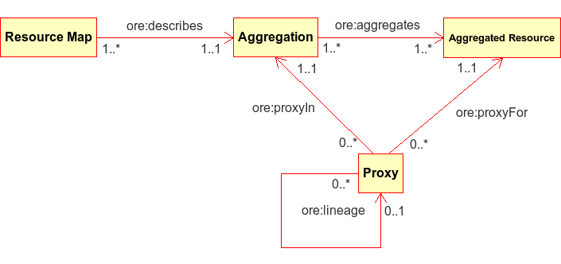

% Open Archives Initiative (OAI)
% Dr. Jakob Voß
% 2014-03-24

# Übersicht

1. Geschichte der OAI
2. Projekte der OAI
    * OAI-PMH
    * OAI-ORE
    * ResourceSync
3. Verwandte Initiativen & Projekte

# Digitale Dokumente

Digitale Dokumente + Internet = freie Verfügbarkeit

1. hochladen
2. auffindbar machen
3. fertig

# Digitale Dokumente

Digitale Dokumente + Internet = freie Verfügbarkeit

1. **hochladen** auf Dokumentenserver
2. **auffindbar machen** mittels dafür entwickelter Standards
3. fertig

# Die ersten Dokumentenserver/Repositories/EPrint-Archive

* Werkzeuge zum (informellen) Austausch von wissenschaftlichen Publikationen
    * Vorabversionen (Preprints)
    * graue Literatur
* Zugriff per FTP, später Gopher/WAIS/HTTP
* Beschreibung der Dateien mittels einfacher `README` Dateien
* Zunehmend strukturiertere Beschreibung (*Digital Libraries*)
* Zunehmende Bedeutung mit steigender Nutzung

# Die ersten Dokumentenserver (Auswahl)
 
* 1991: <http://www.arxiv.org> (Paul Ginsparg)
* 1993: Research Papers in Economics (RePEc, T. Krichel)
* 1995: *Dublin Core*
* 1995: Erste Ausgabe der Online-Zeitschrift *D-Lib Magazine*
  über Digitale Bibliotheken: <http://www.dlib.org/>
* 1996: Networked Digital Library of Theses Dissertations
* 1996: *Google*
* 1997: Cogprints (Stevan Harnad)
* 1999: Santa Fe Convention (25 Teilnehmer)\
  Gründung der **Open Archives Initiative**
* 2002: *Budapester Open Access Erklärung*

# Open Archives Initiative

# Ziel der Open Archives Initiative

* Auffindbarkeit von Inhalten in verteilten Dokumentenservern
* Treibende Kräfte: Carl Lagoze & Herbert Van de Sompel
* <http://www.openarchives.org/>

Mehr zu den Anfängen siehe @VanDeSompel2000.

# Ergebnis der Open Archives Initiative

Definition eines Standards zur *Interoperabilität* (siehe 5.5.)

OAI-PMH
  : OAI Protocol for Metadata Harvesting

Auffindbarkeit für einfache Publikationsarten (E-Prints/Preprints) durch
Anwendung von OAI-PMH in praktisch allen wissenschaftlichen Repositories
theoretisch erreicht.

# Projekte der OAI

* 2001: OAI Protocol for Metadata Harvesting (OAI-PMH)
* 2006: OAI Object Reuse and Exchange (OAI-ORE)
* 2012: ResourceSync

Daneben verschiedene Initiativen und Veranstaltungen z.B. 
das [Open Archives Forum](http://www.oaforum.org/) (2002/03).

# OAI Protocol for Metadata Harvesting (OAI-PMH)

Problem
  : Suche in verteilten Repositories
Lösung
  : Aggregation von Metadaten mittels Harvesting

# OAI-Terminologie

Archive
  : Sammlung von Dokumenten
Repository
  : Sammlung von Dokumentbeschreibungen (Metadata)
Harvesting
  : Abrufen von Metadaten aus einem Repository
Data Provider
  : Stellen Metadaten in Repository bereit
Service Provider
  : Rufen Metadaten aus Repositories ab und stellen
    einheitlichen Dienst (Suchoberfläche) bereit

# OAI-Harvesting

~~~~ {.dot .dpi=300 .scale=70%}
digraph {
  size="600,800";
  rankdir=LR;
  node [label="Data Provider"] DP1;
  node [label="Data Provider"] DP2;
  node [label="Data Provider"] DP3;
  node [label="Service Provider"] Harvester;
  DP1 -> Harvester [label="OAI-PMH"];
  DP2 -> Harvester [label="OAI-PMH"];
  DP3 -> Harvester [label="OAI-PMH"];
}
~~~~

# Beispiel

Data-Provider
  : Server für Wissenschaftliche Schriften der Hochschule Hannover (SerWisS)
Service-Provider
  : Bielefeld Academic Search Engine (BASE)

Weitere Beispiele (nicht ganz aktuell):

* <http://www.openarchives.org/Register/BrowseSites>
* <http://www.openarchives.org/service/listproviders.html>,
  <http://www.opendoar.org/>

# Übung

*Suche in BASE nach Titel aus SerWisS und arXiv und umgekehrt*

# OAI-PMH im Detail

* Möglichst einfaches Protokoll
* HTTP-Anfragen
* XML-Antworten
* Metadaten über beliebige Dokumente (Resourcen)
* Metadaten *mindestens* in Dublin Core
* Verschiedene Abfragemöglichkeiten
* Kein Suchprotokol!
* Definierte Fehlermeldungen

# Mögliche Anfragen (verbs) per OAI-PMH

* Identify
* GetRecord
* ListRecords
* ListIdentifiers
* ListMetadataFormats
* ListSets

# OAI-PMH-Terminologie

Itentifier
  : Eindeutige ID pro Dokument
Set
  : (Teil)menge von Dokumenten
Record
  : Metadatensatz über ein Dokument.

# Verschiedenen Formate und Sets

~~~~ {.dot .dpi=300 .scale=70%}
digraph {
  size="600,800";
  rankdir=TD;
  SetX -> Dokument;
  SetY -> Dokument;
  SetZ -> Dokument;
  Dokument -> Identifier;
  node [label="Dublin Core Record"] dc;
  Identifier -> dc;
  node [label="MARC Record"] marc;
  Identifier -> marc;
}
~~~~

# Mögliche Anfragen (verbs) per OAI-PMH

Identify
  : Was ist das hier für ein Repository?
GetRecord
  : Gib mit Metadatensatz!
ListRecords
  : Gib mir alle Metadatensätze!
ListIdentifiers
  : Welche Identifier gibt es?
ListMetadataFormats
  : Welche Metadatenformate gibt es?
ListSets
  : Welche Sets gibt es?

# Online-Werkzeuge 

* OAI Repository Explorer\
  <http://re.cs.uct.ac.za/>
* OAI-PMG Validator & data extractor\
  <http://oaipmh.com/>

# Aufgaben

*Welche Sets und Metadatenformate bietet SerWiS an?*

*Finde die passenden OAI-PMH-Abfrage!*

# Metadaten

* *header*
    * Identifier
    * Zeitmarken der letzten Änderung
    * ggf. Markierung als gelöscht
* *metadata* (je nach Format unterschiedlich)
* *about* (optional)
    * Rechte & Lizenzen
    * Provenienz

# Harvesting, Freude, Eierkuchen?

* "Metadata's Bitter Harvest" [@Tennant2004]
* Nicht-Bibliothekarische Repositories (Flickr, YouTube, Slideshare...)
* Alternativen zu XML
* Digitale Objekte statt Metadaten

# Stand von OAI-PMH heute

* Einfach & etabliert
* Nischenanwendung für Digitale Bibliotheken
* Umgesetzt in Repository-Software und Clients
* Etwas in die Jahre gekommen

# Projekte der OAI

* 2001: OAI Protocol for Metadata Harvesting (OAI-PMH)
* 2006: **OAI Object Reuse and Exchange (OAI-ORE)**
* 2012: ResourceSync

# OAI Object Reuse and Exchange (OAI-ORE)

* Ziel: Beschreibung von Dokumentstrukturen ("Aggregated Webresources") 
* 2006-2008 entwickelt
* <http://www.openarchives.org/ore>

# OAI-ORE

* TODO: Beispiel

# Konzepte in OAI-ORE

* Aggregated Resource
* Resource Map
* Proxy

# OAI-ORE

# Bewertung von OAI-ORE

* Sehr abstrakt, dafür aber noch übersichtlich
* Nützliche Bausteine für RDF
* Als Ganzes nicht brauchbar
* Zu ambitioniertes Ziel

"What would Ted Nelson say?"

# Projekte der OAI

* 2001: OAI Protocol for Metadata Harvesting (OAI-PMH)
* 2006: OAI Object Reuse and Exchange (OAI-ORE)
* 2012: **ResourceSync**

# ResourceSync

* Ziel: Synchronisierung von Datensätzen/Dokumenten
* OAI-PMH stößt an Grenzen
* 2012-2014 entwickelt
* <http://www.openarchives.org/rs/>

---

TODO: Beispiel/Details

# Verwandte Initiativen & Projekte

* Open Access Bewegung
* XML Sitemaps
* RSS und ATOM
* Linked Data

# OAI-PMH in XML Sitemaps

Es gibt auch andere Methoden zur Aggregation von URLs

> we've found that the information we gain from our support of OAI-PMH 
  is disproportional to the amount of resources required to support it. 

--- @Mueller2008

* *Mehr zu Web-Crawling am 19.5.* 

# Literatur und Quellenangaben
