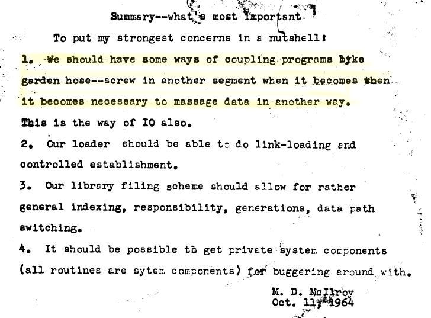

% Datenkonvertierung
% Dr. Jakob Voß
% 2014-04-07

# Was ist Datenkonvertierung?

Überführung von Daten von einem Format in ein anderes Format

* <http://d-nb.info/gnd/4377497-0>\
  Umsetzung (Informatik) = Konversion (Informatik)
* <https://www.wikidata.org/wiki/Q1783551>\
  Data conversion
* ...

# Was ist Datenkonvertierung?

Überführung von Daten von einem Format in ein anderes Format

Überführung
  : Konvertierung, Konversion, Transformation, Mapping...
Daten
  : Datensätze, digitale Objekte/Dokumente, Dateien...
Format
  : Datenstruktur, Dateiformat...

Quellformat $\longrightarrow$ *Konvertierung* $\longrightarrow$ Zielformat

# Anwendungen für Normalnutzer

* Einfache Bild- u.Ä. Bearbeitungen von digitalen Dokumenten
* "Datei speichern unter..."
* Copy & Paste
* Automatisch bei Kopieren und Verschicken von Daten

# Anwendungen für Informationsmanager 

* Import/Export von Daten
* Migration in neue Systeme
* Informationsintegration

# Arten von Konvertierungen

* Verlustbehaftet (z.B. Farbbild in Graustufen)
* Verlustfrei^[Je nach Anwendung, welche Teile relevant sind!] (z.B. PNG nach TIFF)

# Regelbasierte Überführung von Daten

Quellformat $\longrightarrow$ *Konvertierungsregeln* $\longrightarrow$ Zielformat

# Warum regelbasiert?

* Konvertierung (meist) für viele Datensätze
 
* Ohne Regeln sind alles Einzelfälle

* Allgemeine Be- oder Verarbeitungen statt ~~Konvertierungen~~

# Beispiel: Bildbearbeitung

Regelbasiert
  : Thumbnail erstellen
Manuell
  : Bildmotiv passend zuschneiden

# Beispiel: Konvertierung in Großbuchstaben

* Einfache Regel
* Problemfälle
    * Unklare Regeln
    * Unvorhergesehene Quelldaten 

# Regelbasierte Überführung von Daten

* Eindeutige Regeln bilden einen **Algorithmus**
    * semi-formal als Tabelle, Diagramm, Beschreibung... 
    * formal als Implementierung in einer Programmiersprache
* Eindeutige Konvertierungsvorschrift sind *immer* Programme!

Konvertierungs-programm, -skript, -mapping, -tabelle...

---

# Algorithmen und Programme

* Gegenstand der Informatik
* Formuliert in einer Programmiersprache
* Können beliebig komplex sein
* Lassen sich nur schwer überprüfen

# Programme zur Datenkonvertierung

* Oft weniger komplex (zumindest in Teilen)
* Weniger umfangreiche Programmierkenntnisse
* Nicht alle Datenkonvertierer sind Programmierer
* Aufteilung in Beschreibung und Implementierung
    * Beschreibung und Implementierung weichen voneinander ab
    * Regeln müssen angepasst, korrigiert, verändert werden
* Aufteilung in Programm und Konfiguration (DSL)

# Beispiel: (Konkordanz-)Tabelle

-------------- --------------- ------------
Datum           $\rightarrow$  Date        
Autor           $\rightarrow$  Creator     
Übersetzung     $\rightarrow$  Contributor 
Illustrationen  $\rightarrow$  Contributor 
-------------- --------------- ------------

# Beispiel: Ersetzungsregeln

* Nachname, Vorname $\rightarrow$ Vorname Nachname
* Sehr hilfreich: Reguläre Ausdrücke:\
  `(.+), (.+)` $\Rightarrow$  `$1 $2`

# Schwierigkeiten am Beispiel "Nachname, Vorname"

* "Otto"
* "Katharin die Große, Kaiserin von Russland"
* "Welikaja, Jekaterina (russ. Великая, Екатерина)"
* ...

# Technische Schwierigkeiten am Beispiel dieser Folien

`datenkonvertierung.slides.md` (Markdown in Unicode)\
$\rightarrow$ LaTeX
$\rightarrow$ `datenkonvertierung.slides.pdf` (PDF)

# Mappings vs. Konvertierungen

* Einfache Mappings
* Transformationen der Struktur

# Datenverarbeitung durch Konvertierungen

* a -> A
* b -> B
* c -> C
* ...

# Datenverarbeitung durch Aggregtion/Anreicherung

* a & b -> ab
* a & X -> C

# Konvertierungs- und Verarbeitungs-Pipelines

a & b -> ab -> AB -> BA ...

Prinzip in Unix und anderen Systemen

# Übung

Rekonstruktion einer Konvertierung

Buch 
* $\rightarrow$ PICA-Format 
* $\rightarrow$ MARC-Format
* $\rightarrow$ MODS-Format
* $\rightarrow$ Dublin-Core

In Gruppen: 
* Titel
* Contributor
* Date
* Subject

# Daten und Formate

* Format: Menge von möglichen Datensätzen
* Konvertierung aus bzw. in ein Format sollte das Format kennen, d.h. 
  * alle möglichen Sonderfälle berücksichtigen
  * ungültige Datensätze erkennen und abweisen
* Spezialfall Einmal-Konvertierung

# Aufbau von Daten

Werte & Struktur (mit unterschiedlichen Strukturierungsgraden)
 

*siehe Einheit zu Digitalität*

# Eigenschaften von Konvertierungsregeln

* Konvertierung als Mathematische Funktion/Relation
* Ausgangsmenge $\rightarrow$ Zielmenge

Verschiedene Eigenschaften

* Deterministisch
* Links-Total (vollständig definiert)
* Rechts-total (surjektiv)
* eindeutig (injektiv)
* Umkehrbar (bijektiv)

**Bestimmen, welche Informationen in Daten stecken können!**

# Qualitätskontrolle

* Sicherstellen, dass Konvertierung "richtig" ist
* Richtige Konvertierung nach bekannten Regeln
* Richtige Konvertierung nach Beispielen

# Qualitätskontrolle

* Testfälle
    * Eingabe $\rightarrow^?$ erwartete Ausgabe 
* Fehlererkennung
    * Eingabe $\rightarrow$ Ausgabe $=^?$ erwartete Eigenschaften 

# Zusammenfassung

* Überall wo Daten verarbeitet werden, werden auch Daten konvertiert
* Datenkonvertierung ist meist etwas einfacher als Programmierung
* Ähnliche Möglichkeiten & Probleme
* Ohne Datenkonvertierung gibt es Mehraufwand & Inkonsistenzen

# Quellen und Literatur

Flowchart mit Euklids Algorithmus CC-BY [Wvbailey@commons](https://commons.wikimedia.org/wiki/User:Wvbailey>)]

