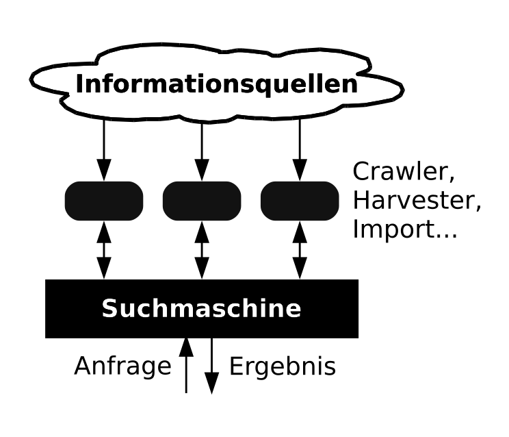
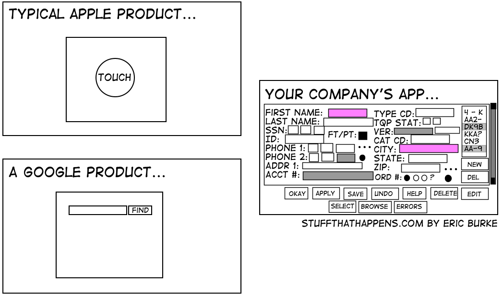

% Suchmaschinen
% Dr. Jakob Voß
% 2014-03-31

# Eingangsfrage: Wie funktioniert Google?

Modul *Information Retrieval aus dem Internet* (2. Semester)

# Eingangsfrage: Wie funktioniert Google?

* Google kocht auch nur mit Wasser
* **Information Retrieval**
* Etablierte Konzepte und Verfahren, versteckt hinter Optimierung, 
  Marketing & Desinteresse

# Eingangsfrage: Wie funktioniert Google?

<http://research.google.com/>

* Google kocht auch nur mit Wasser, allerdings mit
    * Hochdruckkochtöpfen
    * Meerwasserentsalzunganlagen
    * Schwerwasser-Kernfusionsreaktoren
    * ...

# Kernbestandteile einer Suchmaschine

* Datenquellen/-bestand
* **Index**
* **Anfragesprache**
* Suchoberfläche

# Beispiel: GBV-Zentral Index

<http://www.gbv.de/wikis/cls/findex.gbv.de>

* Suchmaschinenindex aller bibliographischen Daten des GBV
* Über 110 Millionen Datensätze
    * ca. 40 Millionen Datensätze des GBV Gesamtkatalog
    * ca. 43 Millionen Artikeldaten Online Contents
    * ca. 23 Millionen Artikeldaten der Nationallizenzen
    * Weitere Inhalte, z.B. DOAJ
* Serviceangebot der VZG für GBV-Bibliotheken zur Verwendung 
  in Discovery-Interfaces (VuFind u.A.)

# Beispiel: Google-Anfragesyntax

<https://support.google.com/websearch/answer/136861>

* Wortgruppen in Anführungszeichen (`"Äpfel und Birnen"`)
* Oder-Verknüpfung (`Äpfel OR Birnen`)
* Negation (`Äpfel -Birnen`)
* Platzhalter (`Äpfel und * vergleichen`)
* Zahlenbreiche (`11...13 Uhr`)
* Domain-Beschränkung (`site:hs-hannover.de`)
* Mit Link auf eine andere Seite (`link:hs-hannover.de`)
* Ähnliche Seiten, Info und Cache (`related:`, `info:`,`cache:`)

# Funktionsweise eine Suche (indexbasiert)

1. Interpretation der Anfrage
2. **Ermittlung & Ranking oder Ergebnisse**
3. Darstellung der Ergebnisse

# Ermittlung & Ranking der Ergebnisse

* Boolesche Algebra und Relationen
* Ähnlichkeitsfunktion

# Zwei verschiedene Suchparadigmen

**Paradigma**

* Vorherrschende Denkweise und Denkmuster
* akzeptierte / nicht hinterfragte Grundannahmen
* Mentales Modell^[vgl. @Christensen2012 zu bibliothekarischen mentalen
  Modellen (OPAC) vs. Nutzer-Modellen (Discovery-Interface)]

Menschliche Sichtweisen ändern sich langsam. Sehr langsam.

# Zwei verschiedene Suchparadigmen

* "Datenbank" (z.B. OPAC, Wikidata..)
* "Discovery-Interface" (z.B. VuFind, Google...)

*Achtung: Suche $\neq$ Datenbestand!*

# Zwei verschiedene Suchparadigmen

-------------------------------------------- -------------------------------------
 Boolesche Anfrage                           Ranking
-------------------------------------------- -------------------------------------
präzise Suchanfrage\                         beliebige, einfache Suchanfragen
in spezieller Syntax                             

Erlernen notwendig                           intuitiv benutzbar

exakte Treffer                               möglichst passende Treffer

geringe Fehlertoleranz\                      fehlertolerant aber falsch-positive
("0 Treffer")

Treffer unsortiert oder\                     Sortiert nach "Relevanz"
nach klarem Kriterium

Szenario: "bekannte" Dokumente finden        Szenario: Dokumente "entdecken"

Mathematik sichtbar\                         Mathematik versteht (Vektorraum)
(Boolesche Algebra)
-------------------------------------------- -------------------------------------

# Kernbestandteile einer Suchmaschine

* **Datenquellen/-bestand**
* **Index**
* Anfragesprache
* Suchoberfläche

*Siehe dazu auch die Einheiten zur Aggregation von Metadaten und zu Crawling & Scraping.*

# Arten von Suchmaschinen (nach Datenbestand & Index)

* Indexbasierte Suchmaschine
* Föderierte Suchmaschine
* Metasuchmaschine

---

---

---

----

# Kernbestandteile einer Suchmaschine

* Datenquellen/-bestand
* **Index**
* Anfragesprache
* Suchoberfläche

# Index

* Erstellung aus dem Datenbestand (Dokumenten)
    * Manuelle Erstellung von Metadaten (siehe Einheit zu *Tagging & Erschließung*)
    * Automatische Indexierung
* Speicherung in Indexstrukturen zur schnellen Abfrage

# Indexarten

Volltextindex
  : Verarbeitung natürlicher Sprache
Feldbasierter Index
  : vorhandene Daten (z.B. Jahreszahl)
Objekt-Index
  : Datenmodell (z.B. Bilder, Koordinaten...)

Ein gesamter Suchindex enthält meist verschiedene Teilindizes.

# Beispiel Volltextindexierung

* Worthäufigkeiten und inverse Dokumentenhäufigkeit
    * **tf** Wort häufig im Text: relevant für Text
    * **idf** Wort häufig in Texten: wenig relevant
* Verbesserung durch Textlinguistische Verfahren:
  Natural Language Processing (NLP)
    * Flexion ("Äpfel" $\Rightarrow$ "Apfel")
    * Analyse von Dokument- und Satzstruktur etc.
    * Named-Entity Recognition

# Aufbau eines Index

* Invertierte Datei
* Beispiel: Indexansicht bei PSI (GBV-Kataloge)\
  <http://gso.gbv.de/DB=2.1/PPNSET?PPN=640209335&PRS=PP%7F>

# Beispiel: GBV-Zentral Index

<http://www.gbv.de/wikis/cls/findex.gbv.de>

* Basierend auf der Suchmaschinen-Software *Solr*
* Läuft als "Cloud" auf mehreren Rechnern
* Konfiguration siehe 
  <https://github.com/gbv/findex-config/blob/master/SolrCloud/solrmarc_config/VZG_index.properties>

# Übung

Datensatz an der HS Hannover (ISIL DE-960),
z.B. Thomas S. Kuhn's "Die Struktur wissenschaftlicher Revolutionen"

* Im OPAC <http://opac.tib.uni-hannover.de/DB=4/>
* In VuFind <https://katalog.bib.hs-hannover.de/>
* MARC-Datensatz (per unAPI oder VuFind-Internformat-Ansicht)
* Analyse der Solr-Konfiguration (siehe findex-config)
* Eingrenzung Suche nach Autor und Publikationsdatum

# Rankingverfahren

* Vektorraummodell
* tf-idf
* PageRank (Links zwischen Dokumenten)
* ...

# Möglichkeiten zur Beeinflussung des Rankings

* Indexanreicherung (Strategie SEO)
* Anfrageexpansion (Strategie Werbung)

# Möglichkeiten zur Beinflussing des Rankings

* Möglichst viele verschiedene Dokumenteigenschaften
    * Inhalt, Herkunft, Bewertung, ...
    * Reichhaltige Metadaten und Volltexte
* Möglichst verschiedene Eigenschaften der Anfrage
    * Unterschiedliche Interpretationen an spezielle Suchmaschinen
    * Personalisierung (Account, Standort u.v.a.m.)

Google bezieht nach eigenen Angaben mehr als 200 Faktoren ins Ranking ein
^[Siehe "So funktioniert die Suche" <http://www.google.de/insidesearch/howsearchworks/thestory/>]

# Kernbestandteile einer Suchmaschine

* Datenquellen/-bestand
* Index
* **Anfragesprache**
* Suchoberfläche

# Anfragesprache

* Discovery-Interface:\
  Anfrage zum Zusammenklicken und Expandieren
* Datenbank:\
  Boolesche Anfrage

Kombinationen möglich!

# Boolesche Anfragen: Beispiele

* Operatoren auf Ergebnismennegen (`AND`, `OR`, `NOT`)
* Ggf. weitere Verknüpfungen durch Relationen
* Ggf. Sortierung nach Kriterium (`ORDER BY`)
* Beispiele
    * SQL
    * Suchanfrage im OPAC
    * [Wikidata-Query](http://wdq.wmflabs.org)

# Beispiel eine Booleschen Anfragesprache: WikiData-Query

* author (P50): Thomas Kuhn (Q184980)\
  `claim[50:184980]`
* Komplexere Beispiele siehe\
  <http://wdq.wmflabs.org/api_documentation.html>

# Beispiel: Solr-Suchsyntax 

Publikationen von Thomas S. Kuhn seit 1980\
`author:[Thomas S. Kuhn] AND publishDate:[1980 TO *]`

# Kernbestandteile einer Suchmaschine

* Datenquellen/-bestand
* Index
* Anfragesprache
* **Suchoberfläche**

# Suchoberfläche

# Suchoberfläche

* Prinzipiell freie Gestaltung
    * Sucheingabe
    * Präsentation von Ergebnissen
* **Usability** durch User Experience (UX)
* "So einfach wie möglich, so kompliziert wie nötig"
* Nutzertests!

# Suchoberfläche: Facettierung/Drill-Down

* Prinzipiell gute Idee
    * wenn die Datengrundlage es hergibt
    * wenn es richtig umgesetzt wird

Beispiel: VuFind-Prototyp der UB Magdeburg\
<http://ubfind.ovgu.de/>

# Suchmaschinen-Software

* Komponenten für einzelne Bestandteile
    * Crawler
    * Datenintegration/aggregation
    * Suchindex
    * Discovery-Interface

# Suchmaschinen-Software

Lucene
  : Suchindex
Solr
  : Server und HTTP-API für Lucene
ElasticSearch
  : Alternativer Server für Lucene, etwas einfacher
VuFind
  : Solr-Index-Suchoberfläche für Bibliotheken
Blacklight
  : Alternatives Solr-Discovery-Interface für Bibliotheken
YaCy
  : P2P-Suchmaschine\
    Beispielanwendung <http://sciencenet.kit.edu/>

# Literatur & Quellen

Vergleich der Suchparadigmen frei nach Till Kinstler.

Dirk Lewandowski (Hrsg.): Handbuch Internetsuchmaschinen (bisher drei Ausgaben)
