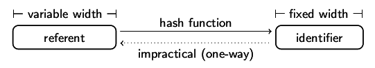

% Identifier
% Dr. Jakob Voß
% 2014-04-14

# Gliederung

1. Einführung Identifikatoren 
2. Wesentliche Anforderungen an Identifikatoren
3. Identifier-Systeme
4. Eigenschaften und Formen von Identifikatoren
5. Hashfunktionen

# Identifier

* Identifikatoren
* ID-Nummern
* Kennungen
* Codes
* ...

In digitalen Systemen überall präsent!

# Beispiele

* Zahlen- und Zeichenkodierungen (Unicode...)
* Identifikationsnummer (Personalausweisnummer, ISBN...)
* Ausführbare Adressen (Telefonnummer, Email, URL...)
* Namen in Computerprogrammen (Variablen, Dateien...)
* ...

# Grundlegende Eigenschaften eines Identifikators

* **Künstliches** Merkmal, das auf ein Objekt verweist
    * konkrete Objekte (Ort, Gegenstand...) 
    * abstrakt Objekte (Ideen, Gesetze...)
* In der Regel eindeutig und damit quasi digital
* Zeichen im semiotischen Sinne

*Gegenbeispiele?*

# Identifikatoren als Zeichen

~~~ {.dot .dpi=300 .scale=80%}
graph {
  size="400,600";
  Vorstellung -- Identifier;
  Vorstellung -- Objekt
  {rank=same Identifier Objekt}
}
~~~

# Quasi-Digitale Identifikatoren

* Klar definierte Menge von Merkmalen
* Eindeutig von anderen Identifikatoren unterscheidbar
* Eindeutige Zuweisung zu Objekten
* Damit einfach zu digitalisieren

Beispiel: Ampel

# Digitale Identifikatoren

* ein Datenobjekt (Bitfolge, Zahl, Zeichenkette...)
* eine Form von Metadatum

Datenobjekt $\Longrightarrow$ Datenobjekt

# Wesentliche Anforderungen an Identifikatoren

* Eindeutigkeit
* Persistenz
* weitere Eigenschaften (kurz, global, verteilt...)

# Eindeutigkeit

* Zwei Arten von Eindeutigkeit
    * nicht homonym
    * nicht synonym
* Identifier *dürfen nicht* uneindeutig sein
* Identifier *sollten* einmalig sein

*Sind die genannten Beispiele eindeutige Identifikatoren?*

# Beispiele und Probleme: ISBN

* Sollten seit ihrer Einführung jedes Buch identifizieren
* Kosten Geld und Aufwand
* Werden manchmal wiederverwendet (meist nur neue Auflage)
* Kommen in vielen Formen vor

# Beispiele und Probleme: ISBN

------------------- -----------------------
ISBN-10 with hyphen 0-486-22543-7
ISBN-10 with space  0 486 22543 7
plain ISBN-10       0486225437
EAN                 9780486225432
EAN barcode aligned 9 78048 622543 2
ISBN-13 with hyphen 978-0-486-22543-2
plain ISBN-13       9780486225432
URN-ISBN            urn:isbn:0-486-22543-7
------------------- -----------------------

# Persistenz

* Identifikatoren sollten sich nicht ändern
* Gegenbeispiele:
    * kaputte URLs
    * neue Handynummer
    * ...
* "Persistente Identifier" sind ein großes Thema!
* Lösungstrategien
    * Verantwortliche benennen
    * Feuer mit Feuer bekämpfen

# Identifier-Systeme

* Verwaltung von Identifikatoren
    * welche IDs gibt es? (**Registry**)
    * wofür stehen sie? (**Resolver**)
    * wie sind IDs aufgebaut? (**Syntax**)
    * wie werden IDs gebildet? (**Vergabe**)
* Regeln und Beziehungen zu anderen ID-Systemen

# Beispiel: URL

Aufgabe: Aufbau einer URL erklären

# Beziehungen zwischen Identifier-Systemen

* EAN, ISBN, ISBN-10, ISBN-13...
* URI, IRI, URN...
* URL, DNS...

# Namensräume und Qualifikatoren

* Strategien zur Lösung von Homonymen
* Üblich auch in kontrollierten Vokabularen
    * Beispiel: Wikipedia-Artikelnamen
    * <https://de.wikipedia.org/wiki/Regen>
* Festlegung auf Syntax erforderlich
    * `Frankfurt/Main`, `Dublin, Ohio`...

# Namensräume und Qualifikatoren
 
* Ggf. zusätzliche Kontextinformationen
    * `Marx, Karl, 1818-1883`
    * `Paris (Mythologie)`, aber auch `Paris_2`
* Ggf. Hinweis auf verantwortliche/übergeordnete Institution
    * `US-OH` (ISO 3166-2 Code)

# Beispiel: Namensraum-Präfix für URIs

Mittel zur Abkürzung in XML

    <skos:prefLabel 
     xmlns:skos="http://www.w3.org/2004/02/skos/core#">

oder in RDF-Turtle

    @prefix skos: <http://www.w3.org/2004/02/skos/core#> .
    skos:prefLabel

    @prefix xxx: <http://www.w3.org/2004/02/skos/core#> .
    xxx:prefLabel

$\Rightarrow$ `http://www.w3.org/2004/02/skos/core#prefLabel`

# Beispiel: Digital Object Identifier System (DOI)

* Zentrale Registry der International DOI Foundation (IDF)
* Für digitale Dokumente (elektronische Publikationen, Forschungsdatensätze...)
* Anwendung des Handle-Systems (Namensraum `10.`)
* Struktur `10.` ORGANISATION `/` ID 
* Einbindung in URI-System 
    * Präfix `doi:`
    * URL-Präfix des IDF-Resolver `http://dx.doi.org/`

# Eigenschaften und Anforderungen and Identifikatoren

* *eindeutig* (nicht uneindeutig und einmalig)
* *persistent* (dauerhaft)
* lesbar und leicht zu merken
* strukturiert
* beschreibend
* einförmig (gleichmäßig verteilt)
* geordnet
* performant
* global
* dezentral verteilt
* ausführbar
* ...

# Strukturierte Identifikatoren

* Identifier mit formaler Syntax
* Beispiele: URL, ISBN...
* oft durch Namensräume und Qualifikatoren
* oft gleichzeitig beschreibende Identifikatoren
 
# Beschreibende Identifikatoren

* Enthalten Angaben über das refenzierte Objekt
* Beispiel: Schwedische Personen-ID
    * `YYMMDDXXXC` 
    * `YY`: Jahr
    * `MM`: Monat
    * `DD`: Tag
    * `XXX`: Fortlaufend (männlich, weiblich..)
    * `C`: Checksumme
* Problem: Eindeutigkeit und Dauerhaftigkeit

# Widersprüchliche Anforderungen

* Nicht gleichzeitig möglich
    * Garantiert eindeutig
    * Lesbar
    * Dezentrale verteilt
* Zwei davon sind jeweils möglich
    * eindeutig & lesbar: zentrale Vergabe
    * eindeutig & dezentral: Web of trust
    * lesbar & dezentral: Pseudonyme 
* Workarounds teilweise möglich

# Hash-Codes

* Basieren auf einer berechenmaren **Hashfunktion**
* Datenobjekt $\Rightarrow$ Hashcode
* Beispiel: Prüfsumme

# Wesentliche Anforderungen an Hashfunktionen

* Einfach/effizient zu berechnen
* Vermeidung von **Kollisionen**

# Beispiel: SHA

* Secure Hash Algorithm (SHA)
* Verschiedene kryptologische Hashfunktionen
* SHA1: $2^{160}$ verschiedene Werte
    * zum Vergleich: Sonne explodiert in weniger als $2^{58}$ Sekunden
    * bis dahin pro Sekunde etwa 4 Millionen Hashes bis $2^{80}$
* Bisher keine Kollisionen für SHA1 bekannt 
* Dennoch in den nächsten Jahren Umstieg auf SHA3

# Anwendungen von Hashfunktionen

* Effiziente Speicherung
* Erkennung von Duplikaten/Änderungen
* Kryptographie

# Hashfunktionen zur Speicherung

* Hashtabelle
* Einfache Hashfunktion
* Streuung über den gesamten Wertebereich
* Verschiedene Verfahren bei Kollisionen (z.B. Listen)

# Hashfunktionen zur Erkennung von Duplikaten oder Änderungen

* Prinzip einer Checksumme
* Erkennung von Änderungen (Datenfehler oder Manipulation)
* Hashwert über Auswahl wesentlicher Merkmale
* Meist eher Heuristik
* Beispiele
    * Initialen
    * Ermittlung von gleichen Werken in Worldcat

# Kryptographische Hashfunktionen

# Kryptographische Hashfunktionen

* Jede noch so kleine Änderung führt zu völlig anderem Hashcode
* Umkehrfunktion **sehr schwer** zu berechnen
* Kollisionen **sehr schwer** zu finden
* Beispiel: SHA
* Anwendung u.A. zur digitalen Signatur, aber auch anderswo (z.B. in git)

# Zusammenfassend sind Identifikatoren:

* **künstliche** Merkmale zur Identifizierung eines Objektes
* immer **digital** im weitesten Sinne
* oft **Metadaten**, da sie auf andere Daten verweisen
* möglichst **persistent und eindeutig**
* Teil von **Identifier-Systemen** mit weiteren 
  Anforderungen und Eigenschaften

# Literaturhinweise

* Identifier. In: Jakob Voß (2013): Describing Data Patterns. Kapitel 3.2, S. 59-71
  <http://aboutdata.org>
* <https://de.wikipedia.org/wiki/Identifikator>

