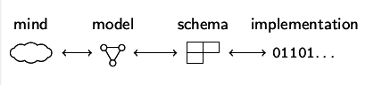

% Semantic Web und Linked Open Data
% Dr. Jakob Voß
% 2014-04-14

# Frage vorab

> Wo kam Semantic Web bereits im Studium vor?

# Semantic Web in digitalen Bibliotheken

* Bibliographische Daten
* Normdaten (Personen, Orte, Themen...)
* Daten über Einrichtungen und Personen (VIVO, Standorverzeichnis...)
* Daten über Dienstleistungen (schema.org...)
* Zur Integration von Daten

# Wie kommen Daten ins Semantic Web?

* Datenkonvertierung (Mapping)
* Veröffentlichung (Open)
* Als Linked Data von einzelnen URLs
* Als Datendumps in größeren Dateien
* Über Schnittstellen (SPARQL u.A.)

Beispiel: GND in RDF

# Datenmodellierung mit Semantic-Web-Techniken

 
# RDF-Graphen

* Menge von Resourcen
    * URIs (meist URLs)
    * Literale (ggf. mit Sprachcode oder Datentyp)
* Menge von RDF-Triples oder -Aussagen
* Am Besten graphisch zu veranschaulichen
* Einige Resourcen gehören zu Ontologien

# URIs als Identifikatoren

* Notwendig zur Identifizierung
* Vorhandene Identifier werden i.d.R. auf URIs gemappt
* Bei Linked Open Data HTTP-URIs

# RDF-Tripel

Subjekt
  : URI
Prädikat
  : URI oder blank node
Objekt
  : URI, blank node oder Literal

Serialisierung beispielsweise als NTripel

# RDF zur Datenstrukturierung

* Vorteil
    * Alles ist ein Graph
    * Zerschneiden und Zusammenführen möglich
* Nachteil
    * Alles ist ein Graph
    * Tabellen, Listen und Baumstrukturen schwierig

# RDF-Serialisierungen

* Verschiedene Kodierungen für die gleichen RDF-Daten
    * RDF/XML
    * NTriples
    * Turtle
    * aREF
    * ...
* Manchmal verwirrend und fehleranfällig
* Für Computer gedacht
* Notwendig

# RDF-Serialisierung in Turtle

* Leichter zu lesen und zu schreiben
* Erweiterung von NTriples
    * Abkürzung von URIs durch Namensräume
    * Subjekt Prädikat Objekt1 **`,`** Objekt2 `.`
    * Subjekt Prädikat  Objekt **`;`**\
      Prädikat2 Objekt2 `.`
    * Blank nodes mit Klammern `[ ... ]`

# Ontologien

* Menge von Klassen und Eigenschaften
* Davon zu unterscheiden: Instanzen
* Inferenz- und Konsistenzregeln 

Beispiele: DC, Schema.org, Bibo, DAIA

# Inferenz- und Konsistenzregeln 

* Automatische Schlussfolgerungen
* Können Computer meist gut berechnen 
* Können Menschen meist nicht so gut überschauen
* Meiner Meinung nach in RDF überbewertet

Einfache Beispiele: `rdf:type`, `rdfs:subClass`, `owl:sameAs`

# Beispiel: SKOS

* Ontologie für Klassifikationen, Thesauri und andere Normdateien
* "Semantic Web light" weil mit Begriffen/Normdatensätze/Deskriptoren
  nur eingeschränkt Logische Aussagen möglich sind

# Bestandteile der SKOS-Ontologie

Benennungen und Synonyme
  : `skos:prefLabel`, `skos:altLabel`
Notationen
  : `skos:notation`
Verweise
  : `skos:broader`, `skos:narrower`, `skos:related` 
Kommentare und Beschreibungen
  : `skos:scopeNote`

# Übung

1. Gruppen bilden
2. Normdatei suchen (außer GND)
3. Einen Normdatensatz suchen
4. URI für den Normdatensatz suchen oder bilden
5. Bestandteile identifizieren
    * Beschreibungen, Benennungen, Notationen
    * Verweise
    * Kommentare und Beschreibungen
6. RDF-Aussagen erstellen
7. RDF/Turtle Beispiel erstellen und erklären

