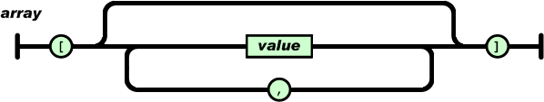
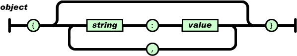

% Datenformate und Standards
% Dr. Jakob Voß
% 2014-05-05

# Übersicht

* Grundlagen
* Allgemeine Datenstrukturierungsprachen
* Konkrete Daten- und Dateiformate
* Standards und Schemata

# Verwandte Themen dieser Lehrveranstaltung

* **Digitalität** am 17.3.2014
* **Datenkonvertierung** am 4.7.2014
* **Identifier-Systeme** am 14.4.2014
* **Digitalisierung** am 12.5.2014

# Was ist Digitalität?

* Daten als Unterschiede ("$x$ being distinct from $y$")
* Daten als Fakten, Beobachtungen und/oder **Nachrichten**
* Daten als unzweifelhafte **Auswahl aus** einer
  klar definierter **Menge möglicher Werte** 
  (z.B. 0 oder 1, ein Unicode-Zeichen...)

# Daten basieren auf Datenmodellierung
 


# Was ist Datenkonvertierung?

Überführung von Daten von einem Format in ein anderes Format

Überführung
  : Konvertierung, Konversion, Transformation, Mapping...
Daten
  : Datensätze, digitale Objekte/Dokumente, Dateien...
Format
  : Datenstruktur, Dateiformat...

# Regelbasierte Überführung von Daten

Quellformat $\longrightarrow$ *Konvertierung* $\longrightarrow$ Zielformat

# Beispiel: Ersetzungsregeln zur Datenkonvertierung

* Nachname, Vorname $\rightarrow$ Vorname Nachname
* Sehr hilfreich: Reguläre Ausdrücke:\
  `(.+), (.+)` $\Rightarrow$  `$2 $1`

*Was sind an diesem Beispiel die Formate?*

*Wie könnten diese Formate als Standard definiert werden?*

# Identifier-Systeme

* Künstliche Merkmale zur Identifizierung eines Objektes
* Meist eindeutig (nicht homonym und möglichst nicht synonym)
* Oft strukturiert und organisiert (Namensräume, Qualifikatoren...)

In Datenformaten an verschiedenen Stellen relevant, z.B. als Index, (Feld)name
oder Pfad.

# Was ist Digitalisierung?

Überführung von analogen Signalen (Zeit, Lautstärke, Farbe, Größe...) in
digital kodierte Werte.


# Bestandteile von Daten bzw. digitalen Kodierungen

Quantisierung
  : Begrenzte Menge zulässiger **Werte**\
    (z.B. Rot, Grün- und Blauanteil je 0 bis 255)
Datenformate
  : Definierte **Strukturen**\
    (z.B. Felder, Dimensionen, Ordnungsmethoden, Muster...)

---

# Allgemeine Datenstrukturierungsprachen

1. Zeichenketten (Strings)
2. Comma Separated Values (CSV)
3. JavaScript Object Notation (JSON)
4. Extensible Markup Language (XML)
5. Resource Description Framework (RDF)

Verwandte Systeme (hier aber ausgelassen):

* Datenbanken
* Dateisysteme
* data binding languages

# DSS 1/5: Zeichenketten

* Liste von Zeichen
* Unicode, ASCII...
* Wenig Struktur
* Spezialfall: leere Zeichenkette (`""`)

# Kodierung von Zeichenketten

* Alles einer vorher angegebenen Länge
* Alles bis zum Ende-Zeichen (z.B. Null-Byte)

Beispiel: Zeichenketten in Anführungszeichen (`"Hallo"`)

*Was wenn die Zeichenkette Anführungszeichen enthält?*

# Typisches Verfahren: Escape-Sequenzen

* Escape-Sequenz für Anführungszeichen `\"`
* Escape-Sequenz für Escape-Zeichen `\\`
* Escape-Sequenzen für Sonderzeichen
    * `\n` : Zeilenumbrung
    * `\t` : Tabulator
    * `\uXXXX` : Unicode-Zeichen mit beliebigem Code XXXX
    * ...

# 2/5: Comma Separated Values (CSV)

* Liste von Zeilen mit Liste von Werten
* Viele verschiedene Varianten
    * Trennzeichen (Komma, Tabulator, Semikolon...)
    * Kopfzeile
    * Zeichenkodierung (ASCII, Unicode...)
    * Escape-Sequenzen (z.B. für Zeilenumbrüche)

# 3/5: JavaScript Object Notation (JSON)

* vorgeschlagen 2002 von Douglas Crockford
* Datenstruktur stammt aus der Programmiersprache JavaScript 
* Relativ einfache Syntax
* Sehr populär, vor allem in Webanwendungen
* Erste Spezifikation und Dokumentation unter <http://json.org/>

# Bestandteile von JSON

* Arrays (Listen)
* Objekte (Key/Value-Menge)
* Zahlen (Ganzzahlen und [Fließ]kommazahlen)
* Zeichenketten (Unicode)
* Boolesche Werte (`true`/`false`)
* Nullwert (`null`)

# JSON-Syntax als Diagram (Ausschnitt)





# JSON-Syntax

* Leerzeilen und -zeichen sind irrelevant
* Zahlen, Boolesche Werte und Nullwerte direkt\
  (`42`, `3.1`, `false`, `null`...)
* Zeichenkette in Anführungszeichen\
  `"Und sie so:\n\"na toll!\""`
* Arrays in eckigen Klammern\
  `[ [ 42, 3.1, ], [ ], [ null, 23, "na, du?!" ] ]`
* Objekte in geschweiften Klammern mit Doppelpunkten
  `{ "Name": "Alice", "Alter": 25, "Geschlecht": null }`

# 4/5 Extensible Markup Language (XML)

* Baumstruktur bestene aus **Elementen**
* Genau ein Wurzelelement
* Jedes Element kann
    * Zeichenketten und Kinder-Elementen enthalten\
      (Sonderfälle Mixed-Content und Empty Tags)
    * Attribute haben
*
* Weitere Besonderheiten, die meist nicht gebraucht werden und
  XML nur viel zu kompliziert machen (DTD, PIs, namespaces...)

# XML-Syntax

* Elemente bestehen aus Start- und End-Tag
* Escape-Sequenzen für Sonderzeichen an verschiedenen Stellen
* Whitespace ist an verschiedenen Stellen irrelevant

*Beispiel: Beliebige XHTML-Seite*

# 5/5 Resource Description Framework (RDF)

Siehe Einheit zu Semantic Web und Linked Open Data am 14.4.2014

* RDF-Tripel Subjekt (URI oder blank node),
  Prädikat (URI) und Objekt (URI, blank node oder Literal)
* Vorteile:
    * Zusammenführen und Ausschneiden immer möglich
    * Einigung auf einheitliche URIs realistisch
* Seralisierung in verschiedenen Formaten (u.A. Turtle)

# Grundsätzliche Strukturen

Allgemeinen Datenstrukturierungsprachen basieren im Wesentlichen auf
allgemeinen Strukturierungsmustern.

Listen
  : Strings
Tabellen
  : CSV
Hierarchien/Bäume
  : JSON, XML
Zuordnungen/Identifier
  : JSON-Objekte, XML-Attribute
Graphen 
  : RDF

Weitere Strukturierungsmuster existieren auch in allen anderen Datenstrukturen
und -Formaten.

# Konvertierung allgemeiner Strukturierungssprachen

Beispiel: CSV nach JSON oder XML\
<https://shancarter.github.io/mr-data-converter/>

# Konkrete Daten- und Dateiformate

* Beispiele sind 
    * immer konkret
    * anschaulich
    * ggf. zu speziell

Was ist Beispiel, was gehört zum Format?

# JSON-Beispiel: Tweet

```
{
  "text": "Old librarians like books. New librarians like data. Good librarians like people.",
  "id": "438186931139383296",
  "retweet_count": "117",
  "favourites_count": "73",
  "source": "web",
  "user": {
    "name": "nichtich",
    "location": "Nauru"
  }
}
```

# Beispiele für XML

* Sitemaps
* OAI-PMH
* TEI
* ...

# Beispiele für RDF

* Jede RDF-Ontologie definiert ein eigenes Format
* Bei RDF lassen sich Formate auch mischen

# Beispiel für Format mit eigener Strukturierung: BibTeX

```
@misc{voss2014librarians,
  author = {Voß, Jakob},
  title  = {Old librarians like books. 
            New librarians like data. 
            Good librarians like people.}
  booktitle = {Twitter},
  year   = {2014},
  day    = {28},
  month  = {2},
  url = {https://twitter.com/nichtich/status/438186931139383296}
}
```

# Standards und Schemata

* Im Zweifelsfall Nachlesen ("RTFM")
* Spezifikationen sind wie Gesetzestexte
* Verschiedene Standard-Gremien und Organisationen
  (W3C, IETF, ISO...)

# Anforderungen an Standards für Datenformate

* Verständlich
* Eindeutig
* Leicht zu Implementieren

Negativbeispiel u.A. Office Open XML (ISO/IEC 29500) mit 6000 Seiten

# Bestandteile einer Spezifikation

* Formale Spezifikation (z.B. Schema-Sprache, Reguläre Ausdrücke etc.)
* Informelle Beschreibung (mit zwingenden und erklärenden Teilen)
* Bezugnahme auf andere Spezifikationen

# Beispiel: Spezifikation von JSON als RFC

* Request for Comment (RFC)
* RFC 7159: 2014 (vorher RFC 4627: 2006, vorher json.org: 2002)

<http://rfc7159.net/rfc7159>

# Beispiel: JSON-Spezifikation


    Object := "{" ( Pair ( "," Pair )* )? "}"
    Pair   := Space* Key Space* ":" Space* Value
    Space  := #x20 | #x09 | #x0A | #x0D

# Beispiel: Open Search Suggestions

HTML $\rightarrow$ OSD-XML $\rightarrow$ Suggestions-JSON

# Zusammenfassung

* Allgemeine Sprachen und Muster zur Datenstrukturierung
  (CSV, JSON, XML, RDF...)
* Konkrete Formate basieren meist auf Datenstrukturierungssprachen 
* Definition durch Spezifikationen und Schemata

