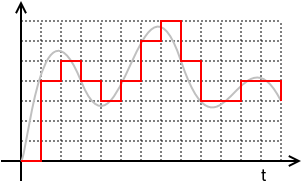

% Digitalisierung und Archivierung
% Dr. Jakob Voß
% 2014-05-12

# Übersicht

* Grundlagen
* Beispiele zur Digitalisierung und Archivierung
    * das Internet Archive
    * die Deutsche Nationalbibliothek 

# Beispiel: Aufzeichnungen der Mondlandung (Appollo 11)

Original-Videoaufnahmen der Mondlandung sind nicht
auffindbar.^[<http://en.wikipedia.org/wiki/Apollo_program_missing_tapes>]

Magnetbänder mit Mondstaub-Daten (Apollo 11, 12 und 14) wurden später
wiedergefunden und konnten erst mit einem IBM 729 Mark V Bandlaufwerk aus dem
Australischen Computermuseum gelesen werden.

# Digitalisierung

Überführung von analogen Signalen in digitale Kodes

# Bestandteile von digitalen Kodes bzw. Daten

Werte
  : Quantisierung von Messwerten (Farben, Töne...)
Strukturen
  : Datenformate, Beziehungen, Zusammenführungen...\
    (Felder, Dimensionen u.A. Ordnungsmethoden und Muster)

# Begriffsklärung

Digitalisierung
  : Überführung von analogen Signalen in digitale Kodes

Retrodigitalisierung
  : Nachträgliche Digitalisierung, Erschließung und Archivierung analoger
    Publikationen (Zeitungen, Zeitschriften, Bücher, Akten, Photographien etc.).

Langzeitarchivierung
  : Archivierung für die Nachwelt (d.h. auch über nicht-vorgesehene
    technologische oder soziokulturelle Veränderungen)

Langzeitverfügbarkeit
  : Dauerhafte Benutzbarkeit

# Ziele & Probleme digitaler Archivierung

Erhaltung digitaler Inhalte zur späteren Nutzung ("die Nachwelt")

* Datenträger und Lesegeräte
* Betriebssysteme, Software, Dateiformate
* Authentizität (Digitale Forensik)
* Datenverlust & Verfälschungen\
  (Unfälle, Unachtsamkeit, Sabotage...)
* Auswahlkriterien
* Verantwortlichkeiten

# Konkrete Aufgaben zum Erhalt digitaler Inhalte

Bitstream-Preservation
  : Substanzerhaltung der Daten\
    (kopieren, digital signieren, Backup...)^[zum
    Vergleich: Mikroform > 500 Jahre]
Erschließung
  : Beschreibung durch Metadaten und einheitliche Kodierung
Verfügbarkeit
  : Sicherstellung der Benutzbarkeit

# Grundsätzliche Verfahren digitaler Archivierung

Museum
  : Erhalt der Hard- und Software
Emulation
  : der Hard- und Software
Migration
  : auf neue Systeme (Konvertierung)

# Technisches Museum

* Erhalt der technischen Umgebung (Hard- & Software)
* Erhalt der Daten (ggf. Auffrischung/Umkopieren)
* Notwendig aber nicht für die Masse geeignet
* irgendwas geht kaputt
* irgendwann kann niemand mehr damit umgehen

# Emulation

* Nachahmung der ursprünglichen Umgebung
* Emulatoren benötigen technische Metadaten
* Emulatoren müssen entwickelt und gepflegt werden
* Entwicklung vor allem durch Liebhaber

# Migration

* Konvertierung in neue Umgebung
* Konvertierung benötigt Strukturdaten
* allgemein komplex und aufwändig
* möglicher Verlust des Kontext (Übersetzungsproblem)
* Nutzbarkeit in aktuellen Umgebungen

# Langzeitarchivierung 

~~~{.dot .dpi=300 .scale=35%}
digraph {
  rankdir=LR;
  Analog  -> N [label="Digitalisierung"];
  Digital -> N [label="Erschließung"];
  N [label=""];
  M [label=""];
  N -> M [label=Erhalt];
  M -> N [label="Migration/Emulation"];
  M -> Nutzung;
  Nutzung -> Digital;
}
~~~

# Zusammenfassung

* Langzeitarchivierung ist immer aufwändig
* Alle drei Strategien (Museum, Emulation, Konvertierung) haben Berechtigung
* Bei jedem Schritt zusätzliche Metadaten
    * Speicherplatz und Rechenleistung wachsen ebenfalls
    * Aber auch Fehler potenzieren sich

# Das Internet Archive

* Gegründet 1996 auf Initiative von Brewster Kahle
* Status einer Kalifornischen Bibliothek mit 501(c)(3)-non-profit Status
* Keine Regierungsorganisation

# Finanzierung und Mitarbeiter des Internet Archive

Budget von etwa 13 Millionen USD pro Jahr

* 40% Spenden und Stiftungen
* 40% Digitalisierungsprojekte
* 20% Bezahlte Webarchivierungsprojekte

Etwa 140 Angestellte

* 100 digitalisieren Bücher
* 40 weitere Angestellte

# Was wird archiviert?

* mehr als 18 Petabyte (18.000.000 Gigabyte) Daten
* u.A. 410 Millarden Webseiten in der Wayback Machine
* etwa 1.5 Millionen Bücher + Filme, VHS, LPs...\
  in Containern zur Langzeitarchivierung
* Jeder kann Inhalte hochladen!

# Webarchivierung

* Wayback Machine
* Webseiten können von Nutzern eingetragen werden
* Archivierung per Auftrag (u.A. von Nationalbibliotheken)
* Eigene Auswahl, z.B.
    * alle in Wikipedia verlinken Seiten
    * alle YouTube-Videos die auf Twitter erwähnt werden
    * ...

# Audio und Video

* 120.000 Konzertmitschnitte von 6.000 Bands
* 40.000 Veröffentlichungen von 2.000 Netlabels
* Hörbücher, Radio, Podcasts
* 60 TV-Kanäle (etwa die Hälfte USA)\
  allerdings nicht verfügbar

# Software 

* CD-Roms, Spiele, Hardware & Emulatoren

*Beispiel: Frogger (1982) auf dem Atari 2600 --- im Browser*

# Deutsche Nationalbibliothek (DNB)

* Gegründet 1912 auf Initiative des Börsenvereins 
* Gesetzlicher Sammelauftrag aller ab 1913 veröffentlichten Medienwerke
  (Pflichtexemplare)
* Seit 2006 auch "Medienwerke in unkörperlicher Form"
* Schrittweiser Aufbau von Erfahrungen mit digitalen Publikationen
    * Hochschulschriften (150.000)
    * eBooks (250.000 BoD + weitere 300.000)
    * eJournals (400.000 ePapers)
    * fast alle digital verfügbaren Tages- und Wochenzeitungen

# Webarchivierung an der DNB

* Relative späte Entwicklung
* Wenig eigenes Know-How da Harvesting über Dienstleister

Probleme

* Schwierigkeit dynamischer Dokumente
* Beschätigung mit dem Urheberrecht
* Langzeitarchivierung

# Beispiele

* Event Harvesting (z.B. Bundestagswahl)
* Selektives Web-Harvesting
* geplanter `.de`-Crawl

# Quellen

* *Wer archiviert das Internet?*.
  Podiumsdiskussion am 7. Mai auf der re:publica 2014
  <http://re-publica.de/session/wer-archiviert-internet>

