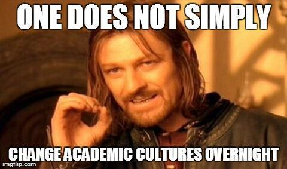
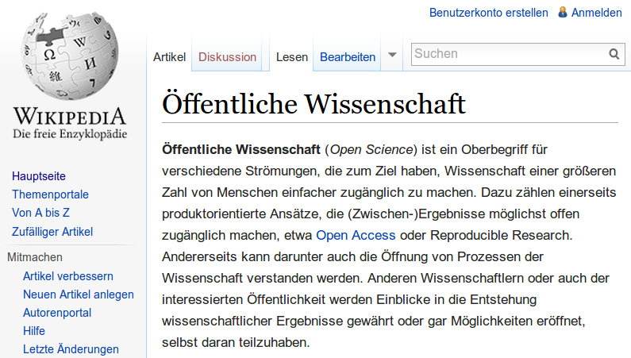
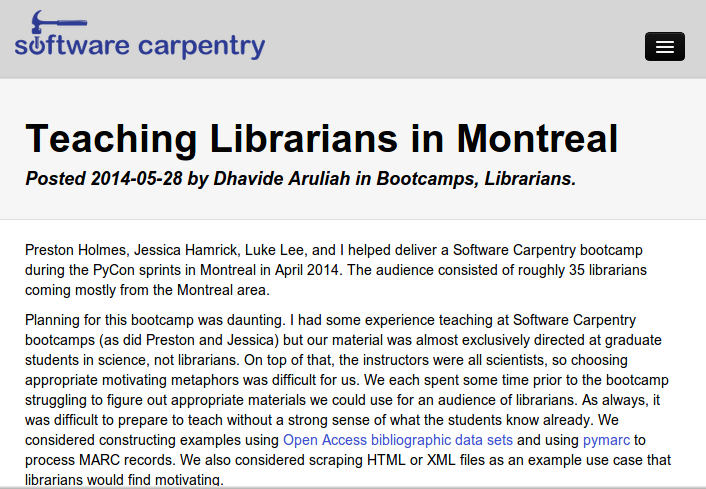
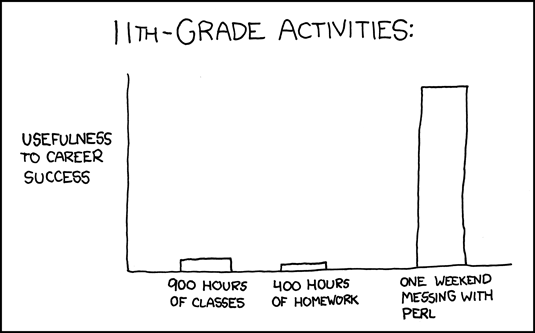

% Open Science
% Jakob Voß
% 2014-06-02

---

Die Anzahl wissenschaftlicher Publikationen wächst exponentiell.
^[Bornmann and Mutz, 2014; van Raan, 2000; de Solla Price, 1965...]

# Zeitschriftenkrise

Die großen Wissenschaftsverlage (Springer, Elsevier, Wiley)
machen praktisch mehr Gewinn pro Umsatz als Apple und andere Firmen.

# Gleichzeitig...

Das Internet ermöglicht einen radikalen Wandel...

* der Wissenschaft

*höher, schneller, weiter...mit **Open Science!***

---

[Jon Tennant (@Protohedgehog)](https://twitter.com/Protohedgehog/status/466601215347134465)

# Open Science

Was ist **Open Science**?

---

<http://de.wikipedia.org/w/index.php?title=Open_Science&oldid=128912895>

---

Jede(r) kann Wissenschaft betreiben!

* *Siehe Wikipedia*
* *Siehe Einheit zu Crowdsourcing & Crowdfunding (7.4.)*

---

Jede(r) kann sich über aktuelle High-End-Forschung informieren!

* *Siehe Wikipedia*
* *Siehe Einheiten zu OAI (24.3.) und Repositories (26.5.)*

[arXiv](http://arxiv.org), [PLOS ONE](http://www.plosone.org),
[PeerJ](https://peerj.com/), [scilogs.de](http://scilogs.de),
[scienceblogs.de](http://scienceblogs.de/)...

----

Jede(r) kann Forschungsdaten und Ergebnisse veröffentlichen und herunterladen!

* *Siehe Einheit zu Forschungsdaten (26.5.)!*

...[Academic Torrents](http://academictorrents.com/),
[Zenodo](https://zenodo.org/), [Figshare](http://figshare.com),
[DataCite](https://www.datacite.org/)...

# Beispiel

Datensätze aus "Capital in the 21st Century"^[Harvard University Press
2014, von Thomas Piketty] in der (numerischen) Daten-Suchmaschine 
[Quandl](http://www.quandl.com/):

* <http://www.quandl.com/PIKETTY>

---

Jede(r) kann wissenschaftliches Arbeiten lernen!

* Penflip, FidusWriter, [WriteLaTeX](https://www.writelatex.com/)...
* Zotero, Mendeley, BibSonomy, Citavi...
* [Software Carpentry](http://software-carpentry.org/)
* [ScienceScape](https://sciencescape.org/)
* ...

----

----

<http://xkcd.com/519/>

----

Jeder(r) kann Geld fürs Forschen sammeln!

* *Siehe Einheit zu Crowdsourcing & Crowdfunding (7.4.)!*

...[ScienceStarter](http://sciencestarter.de)...

----

Jeder(r) kann Teil der Wissenschaftscommunity werden!

...ResearchGate, Mendeley, Academia.eu, [PeerJ](https://peerj.com)...

----

# Bausteine des Wandels zu Open Science

* Wissenschafts-Suchmaschinen (Google Scholar, BASE...)
* Open Access
* Forschungsdaten
* Institutionelle und Fachliche Repositories
* Plattformen zum Schreiben und Austauschen von Dokumenten\
  (Google Docs, Etherpad, WriteLatex, Penflip...)
* Bibliographien & Literatursammlungen\
  (Zotero, Mendeley...)
* Digitale Forschungscommunities
* Datenanalyse-Werkzeuge 
* Crowdsourcing & -funding
* ...

# Lizenz und Quellenangaben

Diese Präsentation basiert im Wesentlichen auf einer Präsentation von
John Dupuis ([@dupuisj](http://twitter.com/dupuisj)), die unter 
<http://bit.ly/subtledupuis> als CC-BY verfügbar ist.

Ausgangsdateien dieser Präsentation:
<https://github.com/hshdb/hshdb2014/tree/master/2014-06-02>
